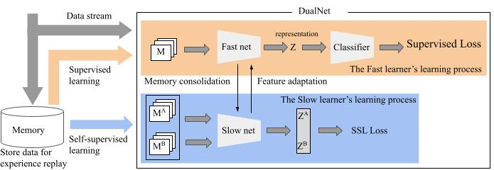

# DualNet: Continual Learning, Fast and Slow

This project contains the implementation of the following NeurIPS 2021 paper: 

**Title:** DualNet: Continual Learning, Fast and Slow (NeurIPS 2021), [[openreview]](https://openreview.net/forum?id=eQ7Kh-QeWnO), [[pdf]](https://proceedings.neurips.cc/paper/2021/file/86a1fa88adb5c33bd7a68ac2f9f3f96b-Paper.pdf). 

**Authors:** [Quang Pham](https://sites.google.com/view/quangpham93), [Chenghao Liu](https://sites.google.com/view/liuchenghao/home), and [Steven Hoi](https://sites.google.com/view/stevenhoi/home)

DualNet proposes a novel continual learning framework for (online) continual learning where a slow network gradually accumulates knowledge to improves its general representation over time and a fast network utilizes the slow representation to quickly learn new information.



# Requirements
- python 3.7.3
- pytorch >= 1.8
- torchvision >= 0.9
- Kornia >= 0.5.0

# Benchmarks
### 1. Prepare data
The `data/` folders contains the train and test splits for the miniImageNet and CORE50 benchmarks. Download the raw data and modify the path in the `csv` files to point to the raw data folder.

### 2. Run experiments
To replicate our results on the task aware and task free settings, run
```
chmod +x scripts/*
./scripts/task_aware.sh
./scripts/task_free.sh
```

The results will be put in the `resuts/` folders.

### Semi-supervised learning setting
For the semi-supervised continual learning experiments, run
```
./scripts/semi.sh --rho 0.1
./scripts/semi.sh --rho 0.25
```
The parameter `rho` indicates the percentage of data that are labeled (e.g. 10% or 25%).

# Citation
If you found DualNet useful for your research, please consider citing.
```
@article{pham2021dualnet,
  title={DualNet: Continual Learning, Fast and Slow},
  author={Pham, Quang and Liu, Chenghao and Hoi, Steven},
  journal={Advances in Neural Information Processing Systems},
  volume={34},
  year={2021}
}
```
